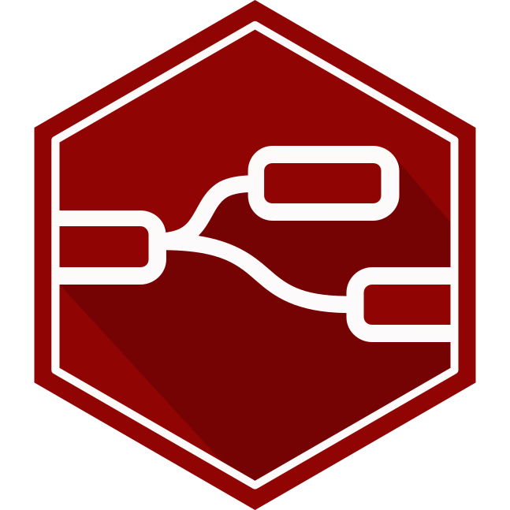

<p align="center">
  
</p>

# Node-RED on StartOS

> Everything not listed in this document should behave the same as upstream
> Node-RED. If a feature, setting, or behavior is not mentioned here, the
> upstream documentation is accurate and fully applicable — see the
> Documentation section of `instructions.md` for links.

[Node-RED](https://github.com/node-red/node-red) is a flow-based programming tool for event-driven applications. A browser editor wires nodes into flows; a Node.js runtime executes them.

---

## Table of Contents

- [Image and Container Runtime](#image-and-container-runtime)
- [Volume and Data Layout](#volume-and-data-layout)
- [File Models](#file-models)
- [Dependencies](#dependencies)
- [Network Access and Interfaces](#network-access-and-interfaces)
- [Installation and First-Run Flow](#installation-and-first-run-flow)
- [Actions](#actions)
- [Tasks](#tasks)
- [Health Checks](#health-checks)
- [Backups and Restore](#backups-and-restore)
- [Limitations and Differences](#limitations-and-differences)
- [Quick Reference for AI Consumers](#quick-reference-for-ai-consumers)

---

## Image and Container Runtime

The package wraps the upstream `nodered/node-red` image unmodified — the Alpine variant, which carries the build toolchain that palette nodes with native components need to compile. The `-minimal` variant does not, and would break palette installs.

| What          | Value                                                                   |
| ------------- | ----------------------------------------------------------------------- |
| Image source  | `nodered/node-red`, upstream, unmodified                                |
| Architectures | `x86_64`, `aarch64`                                                     |
| Entrypoint    | The image's own, with `--settings /assets/settings.js` appended         |

The image's entrypoint forwards trailing arguments to `red.js`, which is how the settings path is overridden without replacing the command. It bundles no init system, so the daemon does not run as PID 1.

One subcontainer, `node-red-sub`, runs both the `chown` oneshot and the `primary` daemon. Attach to it with `start-cli package attach node-red -n node-red-sub`.

## Volume and Data Layout

Two volumes, only one of which the service can see. `main` is mounted at the path Node-RED is told to use as its user directory, so flows, credentials, library and installed palette nodes all land in one place. `startos` holds the package's own state and is mounted nowhere, which keeps the stored password hash and the flow-credential encryption secret out of reach of the flows Node-RED runs.

| Volume    | Mount point  | Holds                                                                                                                        |
| --------- | ------------ | ---------------------------------------------------------------------------------------------------------------------------- |
| `main`    | `/data`      | `flows.json`, `flows_cred.json`, `.config.*.json`, `.sessions.json`, `lib/`, `node_modules/` (palette), `.npm/` (npm cache) |
| `startos` | not mounted  | `store.json`                                                                                                                 |

Palette nodes install into `/data/node_modules` because the image puts that path on `NODE_PATH`. The container process runs as `node-red` (uid 1000), so a `chown` oneshot takes ownership of `/data` before the daemon starts; without it a fresh volume is unwritable and every palette install fails.

There is no database — Node-RED stores flows as JSON files.

## File Models

Node-RED has no config file this package can bind to — `settings.js` is a JavaScript module, not a parseable format — so the package owns that file outright and keeps its own state in a `store.json` instead.

| Model       | File                              | Seeded by               | Rewritten by      | Hand edit survives?                   |
| ----------- | --------------------------------- | ----------------------- | ----------------- | ------------------------------------- |
| `storeJson` | `store.json` on `startos`         | merged defaults at init | the three actions | Yes, until an action rewrites the key |

It holds the admin password hash, the flow-credential encryption secret, the safe-mode flag and the time zone. Nothing else reads or writes it, and every key in it is re-read on each start.

**`settings.js` is not a file model and is not on the volume.** It ships as a package asset, mounted read-only at `/assets/settings.js`, and is passed to Node-RED with `--settings`. Upstream Node-RED copies a default settings file into the user directory on first run; because this package supplies its own path, it never does, and there is no settings file on the volume to edit. Every setting the package fixes — the listen port and host, the flow file name, credential encryption, the auth mode, telemetry, logging, the context stores, the editor theme — is re-asserted from that asset on every start and cannot be changed from inside the service.

Four values reach `settings.js` as environment variables the package sets on the daemon: `STARTOS_ADMIN_USER`, `STARTOS_ADMIN_PASSWORD_HASH`, `STARTOS_CREDENTIAL_SECRET`, and Node-RED's own `NODE_RED_ENABLE_SAFE_MODE`, plus `TZ`. All five are read at process launch only, so a change to any of them restarts the daemon rather than taking effect live.

Context storage is worth naming because it departs from a bare upstream install in one direction only: the default store is still memory, matching upstream, but a second store named `file` is declared alongside it, so a node can opt into persisting its context across restarts by selecting it. Nothing changes for a flow that does not.

## Dependencies

None.

## Network Access and Interfaces

Node-RED serves everything on one port. The editor, its admin API, and any HTTP endpoint a user's flow publishes are all mounted at the root of the same web server, so they share a single interface.

| Interface | Type | Port | Serves                                                     |
| --------- | ---- | ---- | ---------------------------------------------------------- |
| `ui`      | `ui` | 1880 | The flow editor and admin API, plus flow-defined HTTP routes |

The editor and admin API require the admin bearer token. Flow-defined routes do not — see [Limitations and Differences](#limitations-and-differences).

## Installation and First-Run Flow

Upstream Node-RED has no first-run wizard and no authentication: whoever reaches the port can read and deploy flows, and a flow can execute arbitrary code as the container user. This package therefore refuses to run unauthenticated.

On install, `store.json` is seeded and a flow-credential encryption secret is generated into it. No admin password exists yet, so a `critical` task is raised and the service is held stopped until the user runs the action behind it. `setupMain` also throws if it is ever reached with no password hash stored, so the daemon cannot start without one.

The encryption secret is generated once and never rotated. Node-RED encrypts the credentials embedded in flows with it, so a new secret would make every stored flow credential undecryptable.

## Actions

Three actions, all user-facing. None is hidden.

### `set-admin-password`

Run it on install (a task points at it) and whenever the editor password should be rotated. It mints a password, hashes it with the bcrypt implementation bundled in the Node-RED image — run in a temporary subcontainer, so the hash matches what this version of Node-RED expects — writes the hash to `store.json`, and deletes `/data/.sessions.json`.

Deleting the sessions file is what makes rotation real: Node-RED's bearer tokens are valid for seven days and survive a password change on their own. Removing the file and restarting invalidates every one of them.

Costs a few seconds. Safe to repeat, but each run invalidates the previous password, and the password is displayed once and not recoverable afterwards. The daemon restarts because the stored hash is part of its environment.

### `set-timezone`

Run it when scheduled flows should fire on local time rather than UTC. It validates the name against the ICU time-zone database before storing it, and rejects anything unrecognized rather than silently falling back. Writes one key in `store.json`; the daemon restarts. Instant, idempotent.

### `toggle-safe-mode`

Run it when a deployed flow is crashing the runtime or consuming the box, and the editor is unreachable or unusable as a result. It flips one flag in `store.json`; the daemon restarts with `NODE_RED_ENABLE_SAFE_MODE` set, and Node-RED loads the editor without starting any flow, which is enough to edit or delete the offending one.

The flag is sticky — Node-RED keeps starting with flows stopped until the action is run again. Its name and description flip to match the current state, so the same action turns it on and off.

## Tasks

One task, raised by an init watcher.

| Task                                | Severity   | Raised when                              | Cleared by                        |
| ----------------------------------- | ---------- | ---------------------------------------- | --------------------------------- |
| Run `set-admin-password`            | `critical` | `store.json` holds no admin password hash | Running the action                |

Because it is `critical`, the service will not start and its ordinary controls are suspended while it stands — a user reporting "I can't start Node-RED and there are no buttons" is seeing this. It can return: it is re-evaluated on every init, so a restore from a backup taken before a password was ever set raises it again.

## Health Checks

One check, on the `primary` daemon.

It requests `/auth/login` on the service's own port. That endpoint answers 200 whether or not a caller is authenticated, so the check measures whether Node-RED is serving, not whether credentials work.

A failure in the first seconds of a start is Node-RED loading its palette before it binds, which is most of its startup time and grows with the number of installed nodes; the service log records both ends of that window. A failure that persists is a runtime that exited or never bound — the log carries the reason Node-RED stopped. A check that passes while the editor rejects every login means the runtime is healthy and the stored password hash is not what the user is typing; `set-admin-password` resolves it.

## Backups and Restore

Both volumes are copied wholesale. Nothing is dumped, and nothing has to be reconstructed on restore.

`.npm/` is excluded: it is npm's download cache, rebuilt on demand, and backing it up would grow every backup by the size of every palette node ever installed without making a restore any more complete. The installed nodes themselves, under `node_modules/`, are included — Node-RED does not reinstall them on its own, so a restore that dropped them would come back with flows referencing nodes that no longer exist.

A restored instance needs nothing before it is usable. The flow-credential encryption secret rides along in `store.json`, so the credentials inside restored flows decrypt as they did before — which is why the `startos` volume has to be in the backup set, not just the data volume. Palette nodes with compiled native components are the one caveat: they are restored as built, so a restore onto a different CPU architecture would need them reinstalled.

## Limitations and Differences

1. **Flow-defined HTTP routes are not authenticated.** The editor and admin API sit behind the admin password; endpoints a user's flow publishes with an HTTP In node do not. This matches upstream and is what lets external systems call webhooks, but it means exposing this service exposes those routes. Upstream's `httpNodeAuth` setting, which would put HTTP Basic auth in front of them, is not exposed by this package.
2. **One admin account, `admin`, with full permissions.** Upstream's multi-user `adminAuth` lists, read-only users, and OAuth/OpenID strategies are not exposed.
3. **Projects are disabled.** Upstream's git-backed flow versioning is off, so the editor shows no project controls.
4. **The `https` setting is unused.** StartOS terminates TLS in front of the service, and Node-RED serves plain HTTP inside the container.
5. **Telemetry is off but not locked off.** The package sets it disabled, which also suppresses the consent prompt the editor would otherwise show. A user can still turn it on deliberately from the editor's own settings dialog, and that choice takes precedence.
6. **Palette installs need outbound internet.** The palette manager fetches from the npm registry at install time; without it, adding a node fails.

---

## Quick Reference for AI Consumers

```yaml
package_id: node-red
image: nodered/node-red
architectures: [x86_64, aarch64]
subcontainers: [node-red-sub]
volumes:
  main: /data
  startos: null
file_models:
  - store.json
startos_managed_env_vars:
  - TZ
  - NODE_RED_ENABLE_SAFE_MODE
  - STARTOS_ADMIN_USER
  - STARTOS_ADMIN_PASSWORD_HASH
  - STARTOS_CREDENTIAL_SECRET
dependencies: none
interfaces:
  ui: { type: ui, port: 1880 }
actions:
  - set-admin-password
  - set-timezone
  - toggle-safe-mode
tasks:
  - { action: set-admin-password, severity: critical }
health_checks:
  - primary
```
